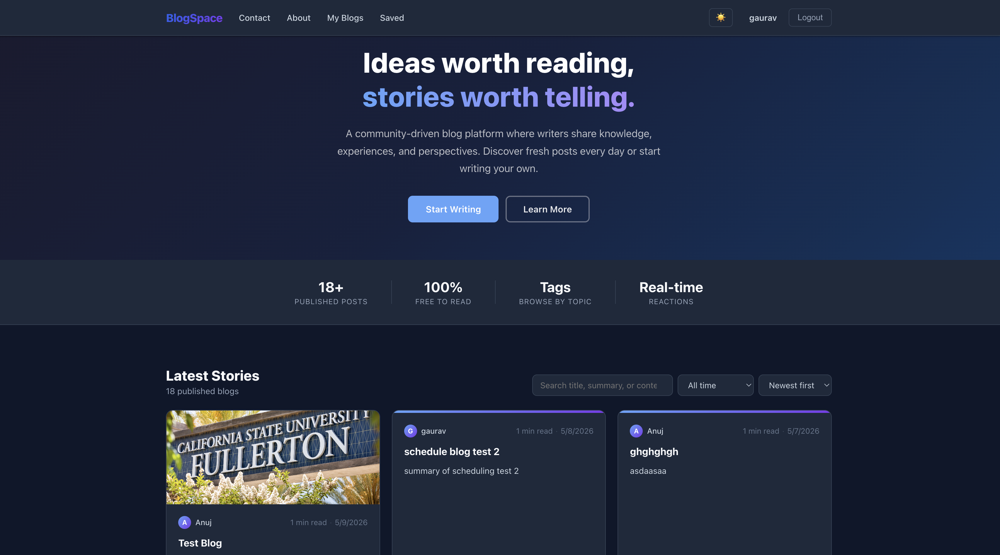
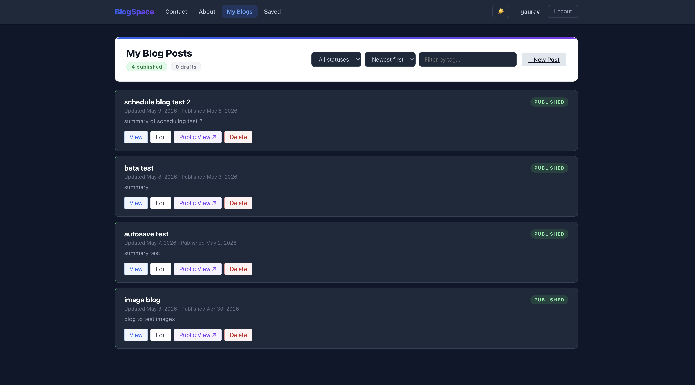
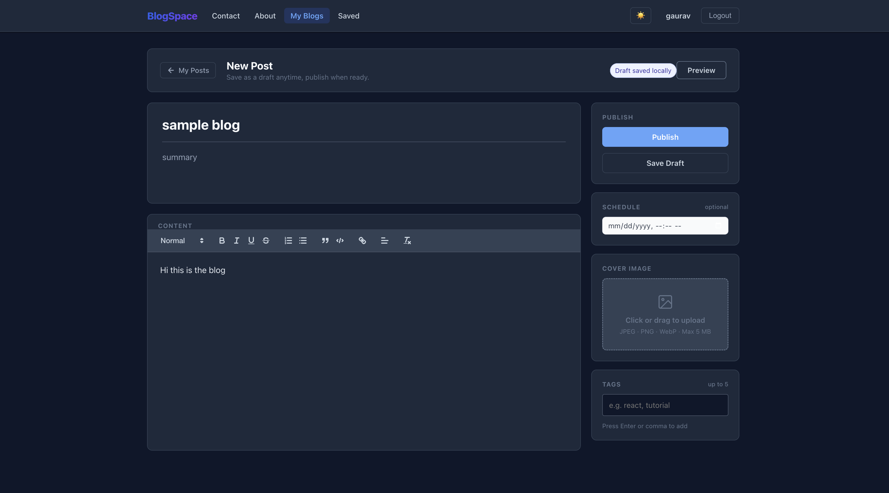
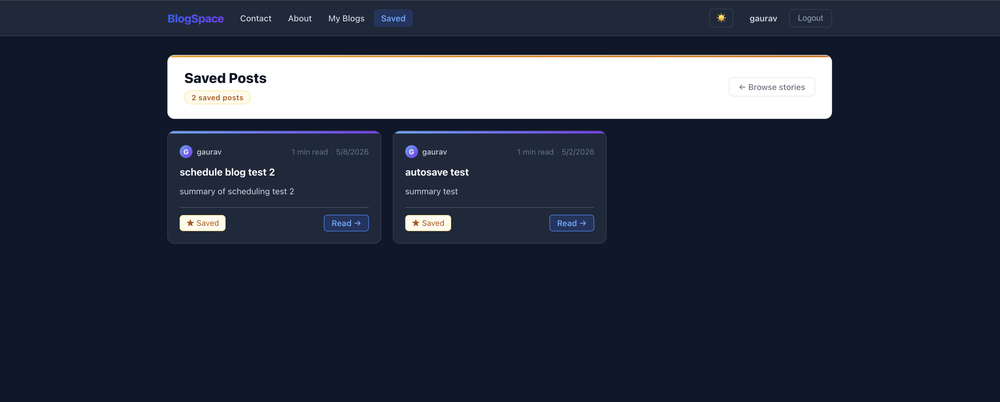

# BlogSpace – Full Stack Blogging Platform

A modern full-stack blogging platform where users can create, publish, schedule, and explore blogs through a clean and interactive UI.

---

## Features

- Create, edit, and delete blog posts
- Schedule posts for future publishing (server-side scheduler)
- Auto-save drafts locally in the browser
- Public feed plus author dashboard (drafts vs published)
- Search, filter, and sort blogs
- Tag-based filtering (up to five tags per post)
- Save / bookmark posts
- Cover image & rich-text media via Cloudinary-backed uploads
- Likes, dislikes, comments, and simple view analytics
- Light / dark theme with persisted preference
- REST API with JWT-protected routes

---

## Screenshots

### Landing Page



### Blog Dashboard



### Create Blog



### Saved Posts



---

## Tech Stack

**Frontend**

- [React](https://react.dev/) 18
- [React Router](https://reactrouter.com/) v6
- [React Quill](https://github.com/zenoamaro/react-quill) & [Quill](https://quilljs.com/) (rich text; HTML + Delta storage)
- [Create React App](https://create-react-app.dev/) (`react-scripts` — Webpack dev server & production build)
- Custom CSS (layered stylesheets, responsive layout, theme variables)
- Browser **localStorage** (draft autosave, theme key)

**Backend**

- [Node.js](https://nodejs.org/) (ES modules)
- [Express.js](https://expressjs.com/)
- [Mongoose](https://mongoosejs.com/) (MongoDB ODM)
- [jsonwebtoken](https://github.com/auth0/node-jsonwebtoken) — JWT auth
- [bcrypt](https://github.com/kelektiv/node.bcrypt.js) — password hashing
- [Multer](https://github.com/expressjs/multer) — multipart file handling for uploads
- [CORS](https://github.com/expressjs/cors) — allowed origins (`CLIENT_URL`)
- [dotenv](https://github.com/motdotla/dotenv) — environment configuration

**Database**

- [MongoDB](https://www.mongodb.com/)

**Cloud & media**

- [Cloudinary](https://cloudinary.com/) — image storage & URLs for covers / editor images (configured via `CLOUDINARY_*` env vars)

**API style**

- REST over HTTP with JSON request/response bodies

---

## Installation

```bash
git clone https://github.com/dgkans/BlogSpace.git
cd BlogSpace

# Install backend and frontend dependencies (separate packages)
cd blog-backend && npm install
cd ../blog-frontend && npm install
```

### Environment variables

Create **`blog-backend/.env`** (see `blog-backend/.env.example`):

```env
PORT=5001
NODE_ENV=development
MONGODB_URI=mongodb://127.0.0.1:27017/blog-app

JWT_SECRET=your-long-random-secret
CLIENT_URL=http://localhost:3000

# Required for cover / editor image uploads
CLOUDINARY_CLOUD_NAME=
CLOUDINARY_API_KEY=
CLOUDINARY_API_SECRET=
```

Optional **`blog-frontend/.env`** if the API is not at `http://localhost:5001`:

```env
REACT_APP_API_URL=http://localhost:5001
```

### Seed sample data (optional)

```bash
cd blog-backend
npm run db:seed
```

### Run the app

Use **two terminals**:

**Terminal 1 — API**

```bash
cd blog-backend
npm start
```

**Terminal 2 — UI**

```bash
cd blog-frontend
npm start
```

- App: [http://localhost:3000](http://localhost:3000)
- Health check (adjust port if you changed `PORT`): `curl http://localhost:5001/api/health`

---

## Project layout

```
├── blog-backend/       # Express API (server.js, models)
├── blog-frontend/      # React SPA
└── docs/screenshots/   # README images
```

---

## License

See repository license file if present; otherwise treat as project coursework unless stated otherwise.
